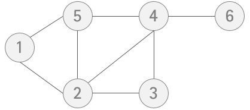

# 📒 Coding Note


## 📋 목차 

1. [그리디](그리디/)

   1. [거스름돈](그리디/거스름돈)
   2. [큰 수의 법칙](그리디/큰수의법칙)
   3. [숫자카드게임](그리디/숫자카드게임)
   4. [1이 될 때까지](그리디/1이될때까지)

   

2. [구현](구현/)
   1. [상하좌우](구현/상하좌우)
   2. [시각](구현/시각)
   3. [왕실의 나이트](구현/왕실의나이트)
   4. [게임 개발](구현/게임개발)


## 👋 문제 풀이 전에 알면 좋은 테크닉

1. ### lambda

   람다 형식은 함수를 딱 한 줄만으로 만들게 해준다.

   + 사용예제

     ```python
     lambda 인자 : 표현식
     
     def hap(x, y):
       return x + y
     
     hap(10, 20) # result : 30
     
     (lambda x, y : x + y)(10, 20) # result : 30
     ```

     

2. ### map

   map의 첫 번째 파라미터는 함수, 두 번째로는 iterable이 들어간다.

   그리고 iterable 데이터를 첫 번째 인자인 함수에 각각 전달하여 결과값을 받는다.

   - 사용예제

     ``` python
     map(function_to_use, list_of_inputs)
     
     # 띄어쓰기로 input되는 정수 값 두개를 받는 변수
     a, b = map(int, input().split()) 
     
     # 1부터 5까지 거듭제곱의 값을 구해 리스트로 받기
     power = list(map(lambda x: x ** 2, range(1,6)))
     # [1, 4, 9, 16, 25]
     ```

     

3. ### filter

   조건이 True인 요소들만 모아준다. 내장 함수여서 속도가 빠르다.

   - 사용예제

     ```python
     numbers = range(-5, 5)
     negative_nums = list(filter(lambda x: x < 0, numbers))
     print(negative_nums)
     # [-5, -4, -3, -2, -1]
     ```

     


4. ### 리스트 컴프리헨션<a name="comprehension"></a>

   리스트를 초기화하는 방법 중 하나이다.

   리스트 컴프리헨션을 이용하면 대괄호 "[ ]" 안에 조건문과 반복문을 넣는 방식으로 리스트를 초기화할 수 있다.

   간단히 0부터 19까지의 수 중에서 홀수만 포함하는 리스트를 만들고자 할 때는 다음과 같이 리스트를 초기화할 수 있다.

   이 경우 한 줄의 소스코드로 리스트를 초기화할 수 있어 매우 간편하다.

   > ``` python
   > array = [i for i in range(20) if i % 2 == 1]
   > # [1, 3, 5, 7, ∙∙∙ 19]
   > ```
   >
   > 위의 코드를 일반적인 소스코드로 작성하면 아래와 같다.
   >
   > ``` python
   > array = []
   > for i in range(20):
   >   if i % 2 == 1:
   >     array.append(i)
   > # [1, 3, 5, 7, ∙∙∙ 19]
   > ```

   다음은 1부터 9까지의 수의 제곱 값을 포함하는 리스트를 만들고자 할 때의 리스트 초기화 방법이다.

   > ```python
   > array = [i * i  for i in range(1,10)]
   > # [1, 4, 9, 16, ∙∙∙ 81]
   > ```

   리스트 컴프리헨션은 코딩 테스트에서 **2차원 리스트를 초기화할 때 매우 효과적**으로 사용될 수 있다,

   예를 들어 N x M 크기의 2차원 리스트를 초기화할 때는 다음과 같이 사용한다.

   > ``` python
   > n = 3
   > m = 4
   > array = [[0] * m for _ range(n)]
   > # [[0, 0, 0, 0], [0, 0, 0, 0], [0, 0, 0, 0]]
   > ```
   >
   > **여기서 잠깐!**
   >
   >    언더바 " _ "의 의미는 반복을 수행하되 반복을 위한 변수의 값을 무시하고자 할 때 언더바(_)를 자주 사용한다.

   

   

5. ### 재귀함수<a name="recursiveFunction"></a>

   DFS와 BFS를 구현하려면 재귀 함수를 이해하고 있어야 한다.

   **재귀 함수**란 `자기 자신을 다시 호출하는 함수`를 의미한다.

   - 간단한 예시

     1. 100번 호출하는 재귀 함수

        ```python
        def recursive_hundred(n):
            if n > 100: return
            print(n)
            recursive_hundred(n+1)
        
        recursive_hundred(1)  
        ```

        

     2. 팩토리얼 n!을 재귀적으로 구현한 함수

        ``` python
        def factorials(n):
            if n <= 1:
                return 1
            return n * factorials(n-1)
            # 5 * (factorials(4) = (4 * (factorials(3) = 3 * (factorials(2) = 2 * 1)))) 
        
        print(factorials(5))
        ```

        

        

6. ### 그래프의 표현방식 2가지

   

   - 노드 6개, 간선 8개

   - 방향이 없는 그래프

   - 노드 : [1, 2, 3, 4, 5, 6]

   - 간선 : [(1, 2), (1, 5), (2, 5), (2, 3), (3, 4), (2, 4), (4, 5), (4, 6)]   

     

   1. 인접 행렬 방식의 구현

      2차원 배열에 각 노드가 연결된 형태를 기록하는 방식이다.

      

      - 노드의 개수를 `V`라고 했을 때, V x V 크기의 2차원 배열을 이용
      - 노드의 연결관계를 `0`과 `1`로 표현
      - `adj[i][j] = 1` (연결이 되었을 때), `0` (연결이 되어있지 않을 때)
      - 양방향 그래프일 경우 `adj[i][j] = adj[j][i]`
      - 이러한 특성으로 인접 행렬을 구현할 경우, 대각 성분을 기준으로 대칭인 성질을 가짐

      

      장점

      - 구현이 매우 간단하다.
      - 노드 간 연결여부를 확인하고 싶을 때는 `adj[i][j]`의 값이 1인지 0인지만 확인하면 됨.  `O(N)` 시간 복잡도를 가짐

      단점

      - 만약 전체 노드의 개수가 V개, 간선의 개수가 E개라고 가정했을 때, 노드 i에 연결된 모든 노드들에 방문을 하고자 할 경우, `adj[i][1] ~ adj[i][v]`까지 모두 확인해봐야 하기 때문에 노드의 갯수에 비례하는 `O(V)` 시간 복잡도를 가짐 

      

      구현

      - 입력 예시

        > 노드 개수 `N`은 6개, 간선 개수 `E`는 8개가 주어진다.
        >
        > 노드 간 연결 정보가 `nodes`라는 리스트에 주어진다.
        >
        > `nodes = [[1, 2], [1, 5], [2, 5], [2, 3], [3, 4], [2, 4], [4, 5], [4, 6]]`
        >
        > 무향 그래프를 구현하는 코드이다.

      - 코드

        ``` python
        n = 6
        e = 8
        nodes = [[1, 2], [1, 5], [2, 5], [2, 3], [3, 4], [2, 4], [4, 5], [4, 6]]
        
        adj = [[0] * n for _ in range(n)]
        
        for src, dst in nodes:
            adj[src-1][dst-1] = 1
            adj[dst-1][src-1] = 1
        
        # result
        # [0, 1, 0, 0, 1, 0]
        # [1, 0, 1, 1, 1, 0]
        # [0, 1, 0, 1, 0, 0]
        # [0, 1, 1, 0, 1, 1]
        # [1, 1, 0, 1, 0, 0]
        # [0, 0, 0, 1, 0, 0]
        ```

        

   2. 인접 리스트 방식

      리스트로 그래프의 연결 관계를 표현하는 방식

      

      - 각각의 노드에 연결된 노드들을 원소로 갖는 리스트들의 배열을 의미

        > `adj[i]` : `i`번째 노드에 연결된 노드들을 원소로 갖는 리스트

      - 인접 리스트 또한 무향 그래프의 경우에는 본인 노드 인덱스의 리스트 내에 서로를 원소로 갖게 됨   

        

      장점

      - 인접 리스트를 활용하여 그래프의 연결 관계를 저장할 경우, 인접 리스트는 인접 행렬과 달리 실제로 연결된 노드에 대한 정보만 저장하기 때문에, 모든 벡터들의 원소의 개수 합이 간선의 개수와 동일하다는 점
      - 간선의 개수에 비례하는 메모리만 차지하여 구현이 가능하여 인접 행렬이 갖는 탐색의 비효율성을 극복

      단점

      - 노드 `i`와 노드 `j`의 연결 여부를 알고싶을 경우 `adj[i]`의 리스트를 순회하며 	`j`원소가 존재하는지 확인해야 한다. 이러한 경우 `O(V)`의 시간 복잡도를 갖게된다. 인접 행렬은 `adj[i][j]`가 1인지 0인지만 확인하면 `i`와 `v` 노드의 연결 여부를 O(1) 시간 복잡도를 통해 확인히 가능했었다.

      

      구현

      - 입력예시

        > 노드 개수 `N`은 6개, 간선 개수 `E`는 8개가 주어진다.
        >
        > 노드 간 연결 정보가 `nodes`라는 리스트에 주어진다.
        >
        > `nodes = [[1, 2], [1, 5], [2, 5], [2, 3], [3, 4], [2, 4], [4, 5], [4, 6]]`
        >
        > 무향 그래프를 구현하는 코드이다.

      - 코드

        ``` python
        n = 6
        e = 8
        nodes = [[1, 2], [1, 5], [2, 5], [2, 3], [3, 4], [2, 4], [4, 5], [4, 6]]
        
        adj = [[] for _ in range(n)]
        
        for src, dst in nodes:
            adj[src-1].append(dst-1)
            adj[dst-1].append(src-1)
            
        # result
        # [1, 4]
        # [0, 4, 2, 3]
        # [1, 3]
        # [2, 1, 4, 5]
        # [0, 1, 3]
        # [3]
        ```

        

      #### **요약**

      - 그래프를 코드로 구현하는 방법은 크게 ***인접 행렬***과 ***인접 리스트***로 나뉜다.
      - 인접 행렬은 구현이 쉽다는 장점이 존재하지만, 간선의 개수에 비해 노드의 개수가 많을 경우 탐색이 비효율적이다.
      - 인접 리스트는 각 노드에 연결된 노드 값만을 원소로 갖는 리스트들의 집합이다.
      - 인접 행렬이 갖는 단점은 인접 리스트를 통해 극복이 가능하다.
      - 인접 리스트는 노드 `i`와 노드 `v`의 연결 여부를 확인하기 위해 노드 `i`에 연결된 노드들을 하나하나 모두 순회하며 확인해야 한다.
      - 각각의 표현 방식은 장단점이 명확해서 문제의 상황에 따라 적절한 방식을 채택하여 사용하는 것이 중요하다

   

   